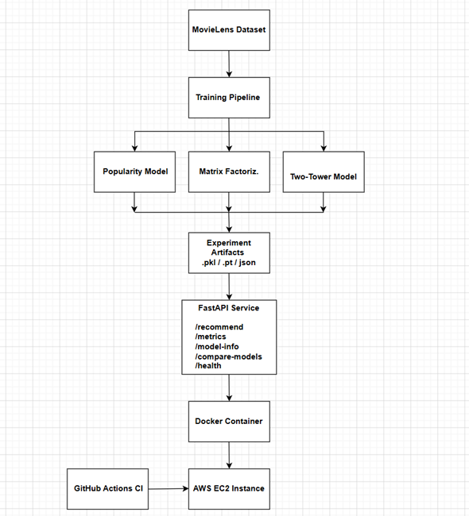
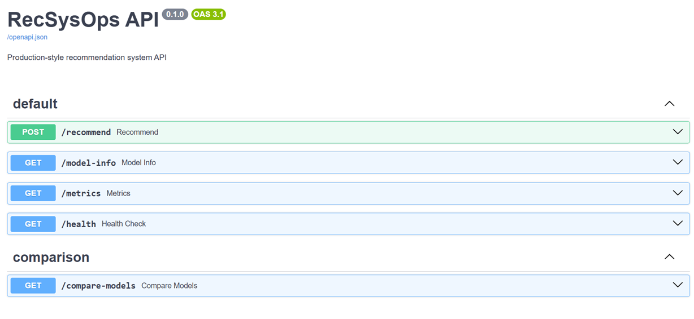
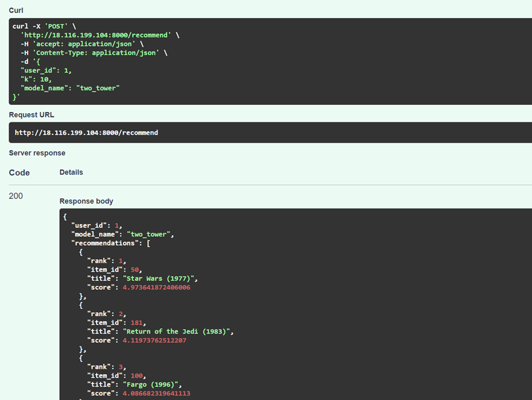
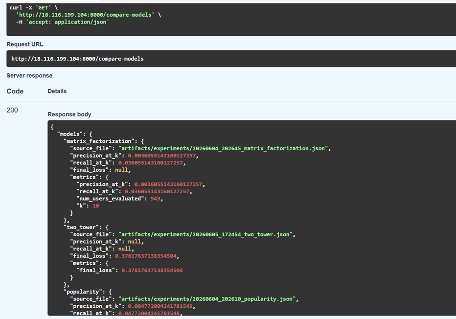
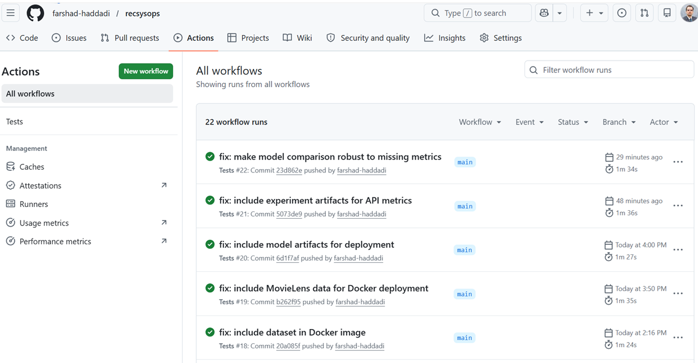

# RecSysOps: End-to-End MLOps Recommendation System

Production-ready recommendation system demonstrating machine learning engineering, MLOps, containerization, CI/CD, experiment tracking, and cloud deployment.

## Overview

RecSysOps is an end-to-end recommendation system built using the MovieLens 100K dataset. The project trains, evaluates, compares, and serves multiple recommendation algorithms through a FastAPI service deployed on AWS EC2 with automated testing and CI/CD.

### Models Implemented

* Matrix Factorization
* Two-Tower Neural Recommendation Model
* Popularity Baseline

### Features

* FastAPI inference service
* Docker containerization
* GitHub Actions CI/CD
* AWS EC2 deployment
* Experiment tracking
* Model comparison endpoint
* Automated testing
* Swagger API documentation
* Model artifact management

---

## System Architecture

The diagram below illustrates the complete machine learning lifecycle from training to deployment.



### Deployment Flow

MovieLens Dataset → Training Pipeline → Recommendation Models → Experiment Artifacts → FastAPI Service → Docker Container → AWS EC2 Deployment

GitHub Actions automatically runs tests and validates changes before deployment.

---

## Screenshots

### API Documentation



Interactive Swagger/OpenAPI documentation generated automatically by FastAPI.

---

### Recommendation Endpoint



Example recommendation request and ranked movie recommendations returned by the API.

---

### Model Comparison



Experiment tracking and model comparison across recommendation algorithms.

---

### CI/CD Pipeline



Automated testing and deployment validation using GitHub Actions.

---

## Model Evaluation

Models were evaluated using Precision@10 and Recall@10.

| Model                | Precision@10          | Recall@10 |
| -------------------- | --------------------- | --------- |
| Popularity           | 0.00477               | 0.04772   |
| Matrix Factorization | 0.00361               | 0.03606   |
| Two-Tower            | Training Loss = 0.378 | N/A       |

Current best model according to Precision@10:

**Popularity Baseline**

---

## API Endpoints

### Health Check

**GET /health**

Response:

```json
{
  "status": "ok"
}
```

### Recommendations

**POST /recommend**

Request:

```json
{
  "user_id": 1,
  "k": 10,
  "model_name": "matrix_factorization"
}
```

### Metrics

**GET /metrics**

Returns training metrics, experiment artifacts, and model information.

### Model Comparison

**GET /compare-models**

Compares available recommendation models and identifies the best-performing model based on evaluation metrics.

### Model Information

**GET /model-info**

Displays available recommendation models and metadata.

---

## Tech Stack

### Machine Learning

* PyTorch
* NumPy
* Pandas
* Scikit-Learn

### MLOps

* Docker
* GitHub Actions
* AWS EC2

### Serving

* FastAPI
* Uvicorn

### Testing

* Pytest

---

## Project Highlights

* Trained and evaluated three recommendation approaches
* Implemented experiment tracking and artifact management
* Built production-style REST APIs using FastAPI
* Containerized the application with Docker
* Automated testing with GitHub Actions
* Deployed inference services to AWS EC2
* Added model comparison and monitoring endpoints
* Created an end-to-end MLOps workflow from training to deployment

---

## Testing

Run locally:

```bash
pytest
```

---

## Local Development

Clone the repository:

```bash
git clone https://github.com/farshad-haddadi/recsysops.git
cd recsysops
```

Build the Docker image:

```bash
docker build -t recsysops .
```

Run the application:

```bash
docker run -p 8000:8000 recsysops
```

Open:

```text
http://localhost:8000/docs
```

---

## Live Demo

### Swagger UI

http://18.116.199.104:8000/docs

### Health Check

http://18.116.199.104:8000/health

---

## Example Results

Current deployed models:

* Matrix Factorization
* Two-Tower Neural Recommendation Model
* Popularity Baseline

The model comparison endpoint automatically evaluates available experiment artifacts and identifies the best-performing model.


---

## Author

**Farshad Haddadi**

GitHub: https://github.com/farshad-haddadi

LinkedIn: https://www.linkedin.com/in/farshadhaddadi
